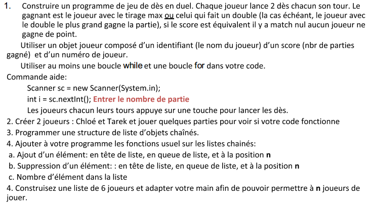

You'll get a little code ?
===

<h2>Lundi</h2>

*Yoga/Meditation (8h50)*

**Back to algorithmic :**

* programme demande à l'utilisateur s'il souhaite jouer, si non alors sortir du programme, si oui, alors proposer de saisir un chiffre entre 1 et 100 et dire à chaque itération si le chiffre est plus petit ou plus grand... une fois le chiffre trouvé, sortir avec un message : vous avez trouvé en x coups !

-> Attention, cette fois-ci, vous devez tourner dans votre équipe, cad qu'au bout d'une heure, prenez la place du dev à votre droite.

* Si vous avez fini, voilà un jeu en bonus : 

<h2>Mardi</h2>

**How to succeed your alternation : Sylvie**

**Workgroup :**

* A partir de votre experience actuelle, vous devez trouver ou mettre en oeuvre une méthode simple, efficace et générique de résolution d'algorithme (1h00)
* Restitution et Mutualisation (5mn/groupe) 
* Mise en pratique de cette méthode au travers des exercices suivants, si besoin, réajuster votre méthode.

31.1 Algo sorting
Either a list of unsorted number, find a way to sort it in ascending and descending order (make the prog on sheet and then on your Ide)

31.1 Palindrome algorithm
- Write a program that indicates if a string is a palindrome, for example : akka, otto
- Find a solution among the capital letters, example: Akka

31.2 Redo the v1 bank project without any help (winter vacation)

31.3 Repeat all exercises with another language of your choice

<h2>Mercredi</h2>

Veille sur les tests unitaires avec Junit

Kata : Trouver le nombre le plus grand dans une liste de nombre entier
Comment automatiser tous ces tests ?

32.1 Utiliser Junit pour les tests unitaires du TP 7 (les opérations add, mul...)

<h2>Jeudi</h2>

Veille sur le multi threading

33.1 Pedro et Sancho ont un compte bancaire commun et cela pose qq pb, 
comment les résoudre ?

**Réflexions autour des Taches & Objectifs de la formation**

<h2>Vendredi</h2>

Veille sur tous les moyens accessible pour améliorer son anglais au quotidien

**Terminer tous vos projets en cours + Spring + Rest + Log4j**

*Sport (16h30)*

<h2>RAPPELS SUR LES CONSIGNES </h2>

++ Prenez l'habitude de créer des nouveaux Workspace par thématique (java/poo/bdd/Jee/Spring/algo), dans lesquels vous créer un projet par TP

**++ Vous devez impérativement commenter vos codes et les faire relire par vos pairs pour valider la compréhension**

++ Vos programmes doivent précisemment répondre aux besoins exprimé

++ respecter les règles d'écriture de code (maj-min)

**++ Les noms de classe, attributs, méthodes et variables doivent être en anglais, suffisamment explicite et compréhensible de tous**

++ attention à l'indentation

++ tester et(ou) mettre en oeuvre des tests unitaires

++ utiliser Git & Github en mode console ou via votre ide

**++ Une fois tous ces critères respectés, vous pouvez mettre votre projet sur github et partager le lien avec vos formateurs et vos tuteurs**

<h2>Ressources</h2>

Tuto sur les Tests en Génie logiciel
[YouTube](https://www.youtube.com/watch?v=hBCaoN421Qs)

[Les tests unitaires en Java - OpenClassrooms](https://openclassrooms.com/en/courses/1301341-les-tests-unitaires-en-java)

Tests unitaires et TDD en Java avec JUnit :
[YouTube](https://www.youtube.com/watch?v=6wE6VhF_uNo)

[KooR.fr - La gestion des threads en Java - Le tutoriel sur le langage de programmation Java](http://koor.fr/Java/Tutorial/Threads.wp)
